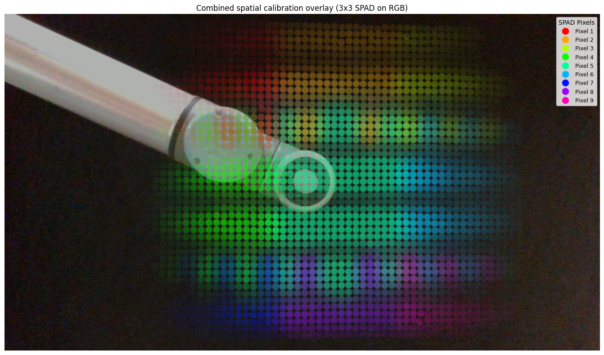

# Spatial Calibration of Diffuse LiDARs

Code release for [*Spatial Calibration of Diffuse LiDARs*](https://arxiv.org/abs/2603.06531) (Behari & Raskar, 2026).

Standard LiDAR calibration assumes each pixel corresponds to a single ray. Diffuse time-of-flight sensors like the TMF8828 violate this — each pixel aggregates photon returns across a broad spatial area. This repository provides tools to determine each pixel's spatial footprint and relative sensitivity by scanning a retroreflective patch through the field of view.


## Quick Start

**No hardware needed.** Run `demo.ipynb` to load the included calibration files and visualize the per-pixel spatial response maps:



## Calibration Pipeline

### Step 1: Capture

Run the calibration capture **twice** — once with the retroreflective patch on the robot arm, once without (for background subtraction):

```bash
cd capture
pip install -e . && pip install pybullet urx
python run_calibration.py   # with patch
python run_calibration.py   # without patch (change OBJECT_NAME)
```

The robot arm moves through a snake-pattern grid (default 80x45 = 3,600 positions), capturing SPAD histograms and co-registered RealSense RGB-D at each step. Output is a timestamped `.pkl` in `capture/logs/`.

### Step 2: Unpack

```bash
cd process
python 1_unpack.py
```

Extracts aligned RGB, depth, and SPAD histogram files from each `.pkl`. Run once per capture.

### Step 3: Find patch centers

```bash
python 2_find_centers.py
```

Opens a GUI to click the patch center in 4 corner images, then automatically refines all ~3,600 positions via Hough circle detection with outlier correction.

### Step 4: Compute calibration

```bash
python 3_calibrate.py
```

Background-subtracts the SPAD histograms and computes the per-pixel peak response at every scan position. Outputs a `.npz` with:
- `responses` (3, 3, K) — spatial response per pixel at each of K positions
- `xs`, `ys` (K,) — patch center coordinates in the RGB image plane

### Step 5: Visualize

Open `process/visualize.ipynb` or run live with hardware:

```bash
cd capture
python capture_with_overlay.py
```

## Hardware

- **SPAD sensor**: [TMF8828](https://ams-osram.com/products/sensor-solutions/direct-time-of-flight-sensors-dtof/ams-tmf8828-configurable-8x8-multi-zone-time-of-flight-sensor) on [TMF882X Arduino Shield](https://ams-osram.com/products/boards-kits-accessories/kits/ams-tmf882x-evm-eb-shield-evaluation-kit) — requires flashing firmware via `arduino-cli` (sketch included in `capture/pkgs/drivers/`)
- **Robot arm**: Universal Robots UR10 — set `ROBOT_IP` in `capture/pkgs/robot_arm/robot_sim.py`
- **RGB-D camera**: Intel RealSense D400 series (848x480)
- **Retroreflective patch**: mounted on the robot arm end-effector
- **3D-printable mounts**: included in `assets/` (sensor bracket + patch holder)

The TMF8828 datasheet is included at `assets/tmf8828_datasheet.pdf`.

## Pixel Ordering

The TMF8828's 3x3 pixel grid is left-right mirrored relative to the camera:

```
Sensor array:          Camera view:
  [0,0] [0,1] [0,2]     [0,2] [0,1] [0,0]
  [1,0] [1,1] [1,2]     [1,2] [1,1] [1,0]
  [2,0] [2,1] [2,2]     [2,2] [2,1] [2,0]
```

The calibration data stores responses in the sensor's native order. The visualization code flips columns at display time only so colors match left-to-right in the camera frame. This does not modify the underlying data.

## Pre-computed Calibrations

| File | Range | Background subtracted |
|------|-------|-----------------------|
| `spad_calib_3x3_longrange_bins15_35.npz` | Long | Yes |
| `spad_calib_3x3_longrange_bins15_35_nobgsub.npz` | Long | No |
| `spad_calib_3x3_shortrange_bins45_75.npz` | Short | Yes |
| `spad_calib_3x3_shortrange_bins45_75_nobgsub.npz` | Short | No |

## Repository Structure

```
capture/                        # Hardware capture code
  run_calibration.py            #   Robot arm grid scan + SPAD/RealSense capture
  capture_with_overlay.py       #   Manual capture with live calibration overlay
  pkgs/                         #   TMF8828 driver, dashboard, utilities, robot arm planner
process/                        # Offline processing
  1_unpack.py                   #   pkl → RGB/depth/histogram files
  2_find_centers.py             #   Detect patch centers in RGB
  3_calibrate.py                #   Background subtraction → calibration .npz
  visualize.ipynb               #   Inspect calibration results
calibrations/                   # Pre-computed .npz calibration files
assets/                         # Reference files and 3D models
  calibration_overview.png      #   Hardware setup photo
  calibration_output.png        #   Example calibration result
  sample_rgb.png                #   Sample RealSense image for demo
  mount_patch_holder.stl        #   Patch holder (robot arm end-effector)
  mount_tmf_realsense.stl       #   TMF8828 + RealSense bracket
  tmf8828_datasheet.pdf         #   Sensor datasheet
demo.ipynb                      # Self-contained demo (no hardware needed)
```

## Citation

```bibtex
@article{behari2026spatial,
  title={Spatial Calibration of Diffuse LiDARs},
  author={Behari, Nikhil and Raskar, Ramesh},
  journal={arXiv preprint arXiv:2603.06531},
  year={2026}
}
```
